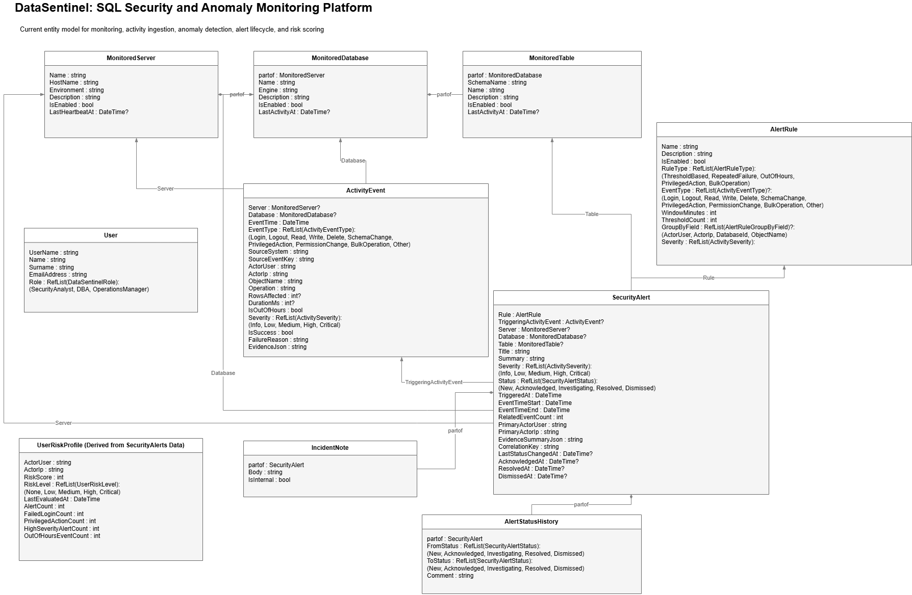

# DataSentinel

## What is DataSentinel?

DataSentinel is a SQL security and anomaly monitoring platform built to help teams detect suspicious database activity early. The system focuses on monitoring SQL-related events, highlighting risky behavior, and presenting security insights through dashboards, alerts, and investigation workflows.

## Why Choose DataSentinel?

- **Security-focused monitoring**: Focused on suspicious SQL activity, not generic analytics
- **Anomaly detection**: Detects transaction spikes, repeated failures, out-of-hours activity, and privileged actions
- **Actionable investigation flow**: Review alerts, manage incidents, add notes, and export reports
- **AI-assisted insights**: Summaries, explanations, and triage guidance to speed up investigations

---

## Architecture Overview

DataSentinel uses a split frontend and backend architecture:

- **Frontend**: Next.js application (`team-2-group-project`)
- **Backend**: ABP application (`aspnet-core`)
- Backend manages monitoring data, alerts, incidents, and risk profiles
- Frontend consumes APIs for dashboards, monitoring, alerts, and reporting
- AI summaries are generated via frontend API routes using an external provider

---

## Features

### Monitoring & Intake

- Import audit-style SQL activity
- Browse and filter events across multiple dimensions
- Simulate monitoring data for demo scenarios

### Detection & Alerts

- Rule-based anomaly detection
- Out-of-hours activity detection
- Repeated failure detection
- Privileged access monitoring

### Incident Management

- Alert queue and investigation workflow
- Status lifecycle management
- Analyst notes and reporting

### AI Integration

- Alert summarization
- Explanation of flagged behavior
- Suggested investigation steps

---

## Design

### Wireframes

https://www.figma.com/make/p4fdXjU9pyS5JwiOdBZkLd/Design-Data-Sentinels-Dashboard?p=f

### Domain Model



---

## Getting Started

### 1. Clone the repository

```bash
git clone https://github.com/hashimaziz88/GroupProjectBoxfusion.git
cd GroupProjectBoxfusion
```

## Running the Application

DataSentinel consists of a backend (ASP.NET Core) and a frontend (Next.js). Both must be running for the system to function correctly.

### 1. Start the Backend

Follow the backend setup instructions in:

`aspnet-core/README.md`

Ensure the backend is running (typically on `https://localhost:____`).

---

### 2. Start the Frontend

Follow the frontend setup instructions in:

`team-2-group-project/README.md`

Once configured, start the frontend:

```bash
npm run dev
```

## Repository structure

- `team-2-group-project` - Next.js frontend
- `aspnet-core` - ABP backend

## Assumptions

- the platform uses simulated or imported SQL and audit-style activity rather than direct live database agents
- the project runs in a tenant-aware environment and most DataSentinel views are tenant-scoped
- the backend is the source of truth for monitoring data, alert lifecycle state, and permissions
- AI features depend on external API configuration

## Trade-offs

- rule-based anomaly detection was prioritized over a heavier machine learning approach to keep the system explainable and achievable within project scope
- batch and simulated ingestion were implemented before live streaming ingestion to reduce infrastructure complexity
- the system favors security-focused workflows over broad BI-style analytics
- AI support is assistive only and does not replace deterministic detection or analyst review
- report exports are lightweight and practical for demos, but not yet a full enterprise reporting pipeline

## AI Usage Disclosure

This project was developed with the assistance of AI tools to support various stages of the development process.

AI was used in the following areas:

- **Design support**: brainstorming features, refining requirements, and shaping user flows
- **Architecture guidance**: discussing system design decisions, trade-offs, and implementation strategies
- **Development assistance**: generating code snippets, suggesting implementations, and accelerating development
- **Debugging support**: identifying issues, explaining errors, and proposing fixes
- **Test creation**: assisting in writing and structuring unit and integration tests

All AI-generated suggestions were **reviewed, adapted, and integrated by the development team**. Final implementation decisions, system design, and code quality remain the responsibility of the team.

AI was used as a **development aid**, not as a replacement for understanding, and care was taken to ensure correctness, maintainability, and alignment with project requirements.
